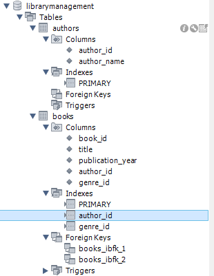
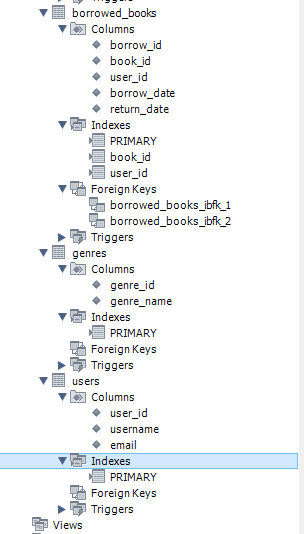

# Завдання 4: Library Management Database (CREATE SCHEMA)

## Опис
База даних для керування бібліотекою книг. Реалізовано з використанням MySQL.  
Містить таблиці авторів, жанрів, книг, користувачів та обліку виданих книг.

## Структура бази даних

- authors
- genres
- books
- users
- borrowed_books

## SQL-скрипт створення структури

```sql
CREATE SCHEMA IF NOT EXISTS `LibraryManagement`;
USE `LibraryManagement`;

CREATE TABLE IF NOT EXISTS `authors`
(
    author_id INT PRIMARY KEY AUTO_INCREMENT,
    author_name VARCHAR(50) NOT NULL
);

CREATE TABLE IF NOT EXISTS `genres`
(
    genre_id INT PRIMARY KEY AUTO_INCREMENT,
    genre_name VARCHAR(50) NOT NULL
);

CREATE TABLE IF NOT EXISTS `books`
(
    book_id INT PRIMARY KEY AUTO_INCREMENT,
    title VARCHAR(100) NOT NULL,
    publication_year YEAR NOT NULL,
    author_id INT NOT NULL,
    genre_id INT NOT NULL,
    FOREIGN KEY (author_id) REFERENCES authors(author_id),
    FOREIGN KEY (genre_id) REFERENCES genres(genre_id)
);

CREATE TABLE IF NOT EXISTS `users`
(
    user_id INT PRIMARY KEY AUTO_INCREMENT,
    username VARCHAR(50) NOT NULL,
    email VARCHAR(50) NOT NULL
);

CREATE TABLE IF NOT EXISTS `borrowed_books`
(
    borrow_id INT PRIMARY KEY AUTO_INCREMENT,
    book_id INT NOT NULL,
    user_id INT NOT NULL,
    borrow_date DATE NOT NULL,
    return_date DATE NOT NULL,
    FOREIGN KEY (book_id) REFERENCES books(book_id),
    FOREIGN KEY (user_id) REFERENCES users(user_id)
);  
```

## Результати:  

*Рисунок-1 (Створення db та таблиць: частина 1)*  
  

*Рисунок-2 (Створення db та таблиць: частина 1)*  
  

*посилання на SQL*  
[SQL_1_Exercise](Exercise_1.sql)


