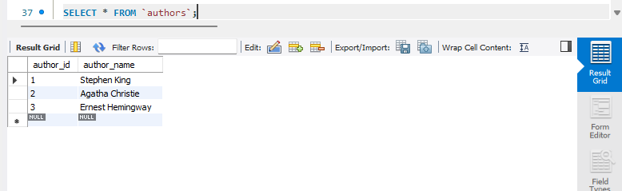
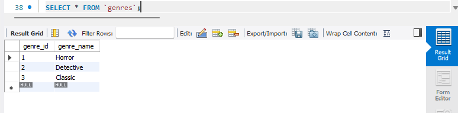
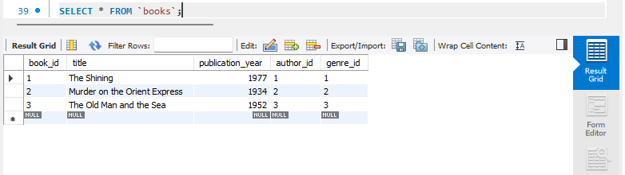
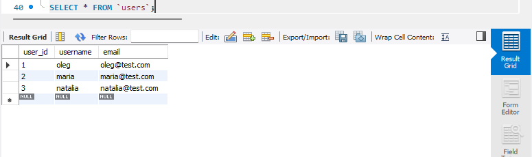
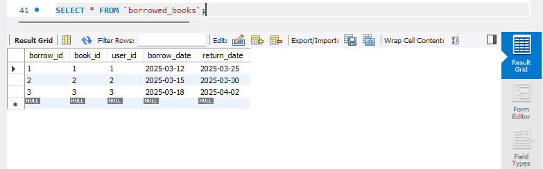

# Завдання 2: Library Management Database (INSERT INTO)

## Опис
Використовуємо `INSERT INTO` для вставки рядків з прикладами


## SQL-скрипт вставки рядків у таблиці

```sql
USE `LibraryManagement`;
-- Завдання №2 :Вставка рядків прикладів. По три рядка у кожну таблицю
---------------------------------------------------
INSERT INTO `authors` (author_name)
VALUES
	('Stephen King'),
	('Agatha Christie'),
	('Ernest Hemingway');
---------------------
INSERT INTO `genres` (genre_name)
VALUES
	('Horror'),
	('Detective'),
	('Classic');
    ---------------------
INSERT INTO `books` (title, publication_year, author_id, genre_id)
VALUES
	('The Shining', 1977, 1, 1),
	('Murder on the Orient Express', 1934, 2, 2),
	('The Old Man and the Sea', 1952, 3, 3);
    ---------------------
INSERT INTO `users` (username, email)
VALUES 
	('oleg', 'oleg@test.com'),
	('maria', 'maria@test.com'),
	('natalia', 'natalia@test.com');
    ---------------------
INSERT INTO `borrowed_books` (book_id, user_id, borrow_date, return_date)
VALUES 
	(1, 1, '2025-03-12', '2025-03-25'),
	(2, 2, '2025-03-15', '2025-03-30'),
	(3, 3, '2025-03-18', '2025-04-02');
    
--- і звісно лишній раз не запускати це все діло, бо будуть дубляжі, а зв"'"зки будуть не логічні(((    
--- Перевірка:

SELECT * FROM `authors`;
SELECT * FROM `genres`;
SELECT * FROM `books`;
SELECT * FROM `users`;
SELECT * FROM `borrowed_books`;
```

## Результати:  

*Рисунок-3 (Вставка рядків: частина 1 `authors`)*  
  

*Рисунок-4 (Вставка рядків: частина 2 `genres`)*  
 

*Рисунок-5 (Вставка рядків: частина 3 `books`)*  
 

*Рисунок-6 (Вставка рядків: частина 4 `users`)*  
 

*Рисунок-7 (Вставка рядків: частина 5 `borrowed_books`)*  
 

*посилання на SQL*  
[SQL_2_Exercise](Exercise_2.sql)


