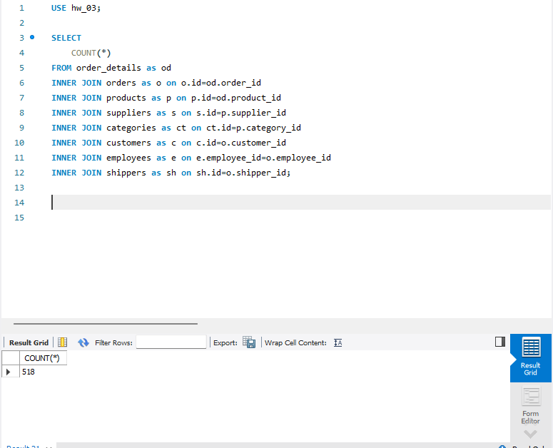

# Завдання 3: Відпрацювання INNER JOIN

## Опис
Використовуємо `INNER JOIN` для об'єднання таблиць  
За основну таблицю взято `order_details`

Важливі особливості `INNER JOIN` :  
1. Фільтрує дані автоматично — без співпадіння рядок не проходить  
2. Найшвидший JOIN у більшості випадків  
3. Основний робочий інструмент аналітики  
4. Неможливо витягнути “порожні” записи  

Зі своєї практики зауважу, що користуюся ним рідко, через боязнь пропустити відсутні дані (які ж можна підкорегувати, або виявити маленький баг тощо). Тобто, потенційно є ризик того, що машинально через відсутність співпадінь в другій таблиці, частина даних може пропасти непоміченою.


## SQL-скрипт `INNER JOIN` x7

```sql
USE hw_03;
--- Завдання №3
SELECT 
	COUNT(*)
FROM order_details as od
INNER JOIN orders as o on o.id=od.order_id
INNER JOIN products as p on p.id=od.product_id 
INNER JOIN suppliers as s on s.id=p.supplier_id 
INNER JOIN categories as ct on ct.id=p.category_id
INNER JOIN customers as c on c.id=o.customer_id
INNER JOIN employees as e on e.employee_id=o.employee_id
INNER JOIN shippers as sh on sh.id=o.shipper_id;
```

## Результати:  

*Рисунок-8 (Використання INNER JOIN)*  
  

Після кожного об'єднання к-ть рядків була незмінною (518), а таблиця збільшувалася в розмірності (при перевірці використовував **SELECT * FROM**, для візуальної оцінки..якось хз як логічно скріни було робити)  
При цьому важливо зауважити, що в подібних запитах важливо перевіряти логіку крок за кроком, коректно називати таблиці та забезпечувати послідовність. Це забезпече можливість створення гнучкої вибірки для аналізу, або інших потреб.


*посилання на SQL*  
[SQL_3_Exercise](Exercise_3.sql)


