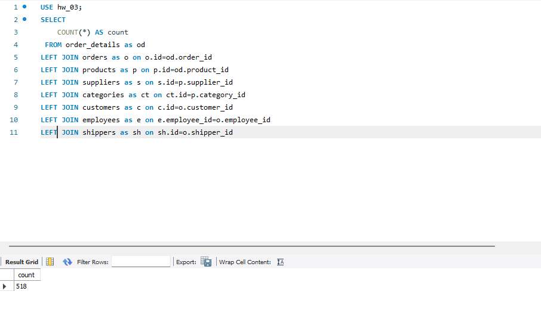
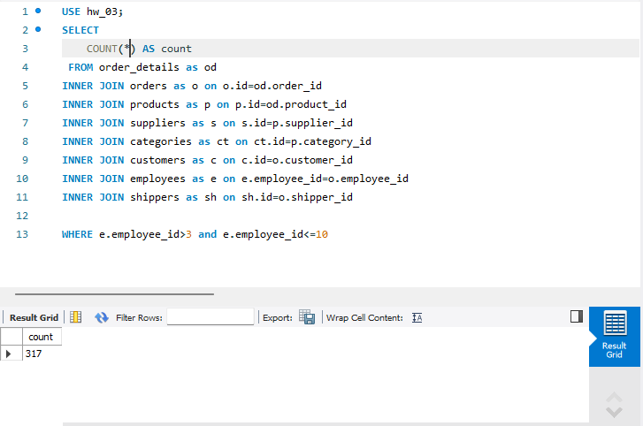
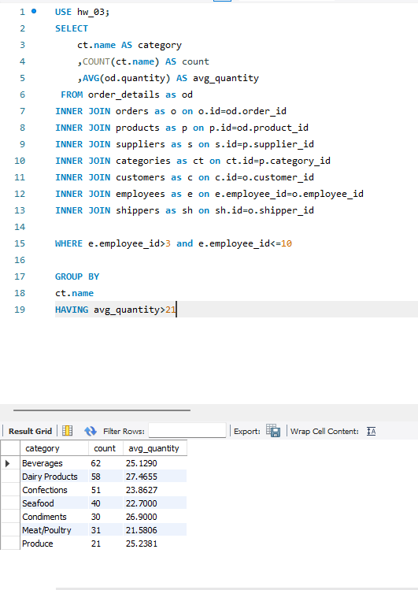
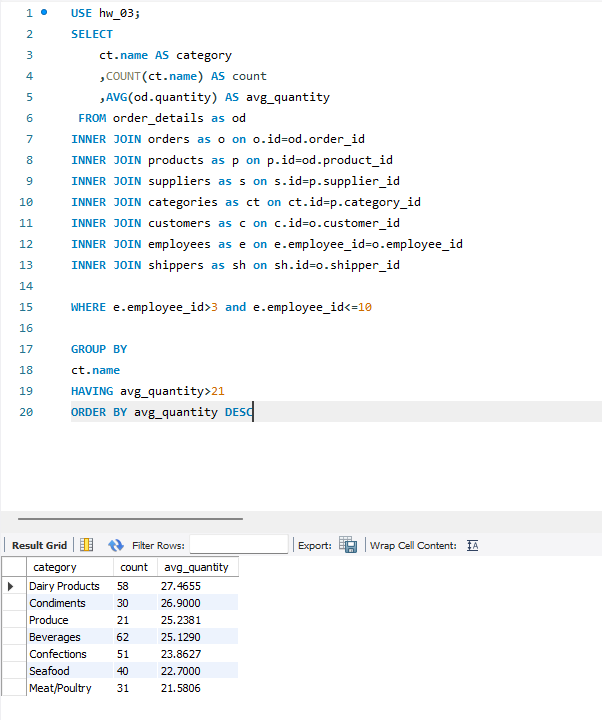
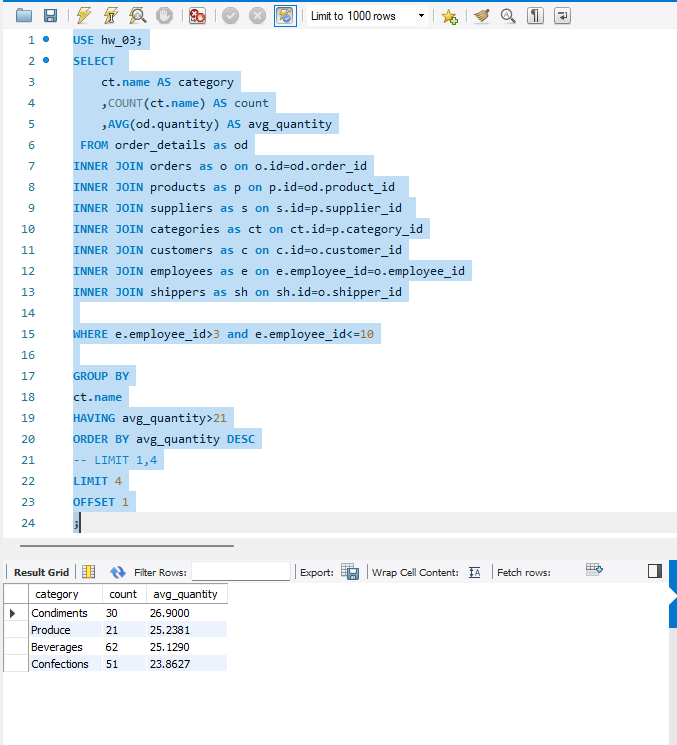

# Завдання 4: Додаткова обробка Exercise_3

## Опис
**На основі завдання №3 опрцьовуємо наступні задачі:**
1. Визначаємо к-ть отриманих рядків (за допомогою оператора COUNT).  
2. Змінюємо декілька операторів INNER на LEFT чи RIGHT. Визначаємо, що відбулося з кількістю рядків.
3. Обираємо тільки ті рядки, де employee_id > 3 та ≤ 10.
4. Групуємо за іменем категорії, рахуємо кількість рядків у групі, середню кількість товару.
5. Відфільтровуємо рядки, де середня кількість товару більша за 21.
6. Сортуємо рядки за спаданням кількості рядків.
7. Виводимо на екран чотири рядки з пропущеним першим рядком.


## 1. Визначаємо к-ть отриманих рядків (за допомогою оператора COUNT). 

```sql
USE hw_03;
SELECT 
    COUNT(*) AS count
 FROM order_details as od
INNER JOIN orders as o on o.id=od.order_id
INNER JOIN products as p on p.id=od.product_id 
INNER JOIN suppliers as s on s.id=p.supplier_id 
INNER JOIN categories as ct on ct.id=p.category_id
INNER JOIN customers as c on c.id=o.customer_id
INNER JOIN employees as e on e.employee_id=o.employee_id
INNER JOIN shippers as sh on sh.id=o.shipper_id
```
*Рисунок-9*  
  

## 2. Змінюємо декілька операторів INNER на LEFT чи RIGHT. Визначаємо, що відбулося з кількістю рядків. 

```sql
USE hw_03;
SELECT 
    COUNT(*) AS count
 FROM order_details as od
LEFT JOIN orders as o on o.id=od.order_id
LEFT JOIN products as p on p.id=od.product_id 
LEFT JOIN suppliers as s on s.id=p.supplier_id 
LEFT JOIN categories as ct on ct.id=p.category_id
LEFT JOIN customers as c on c.id=o.customer_id
LEFT JOIN employees as e on e.employee_id=o.employee_id
LEFT JOIN shippers as sh on sh.id=o.shipper_id
```
*Рисунок-10*  


При використанні `LEFT JOIN` нічого не змінилося, оскільки ми досить чітко з самого початку використали логічну структуру схеми.  


Виходячи з суті завдання можна зробити висновок, що різні JOIN використовуються в різних ситуаціях.  
+ LEFT при чітко зрозумілій структурі та в аналітиці (ризик присутній, якщо порушена унікальність при з'єднаннях, або наявних дублікатах у правій таблиці, що викличе розмноження рядків з значеннями, і як наслідок спотворить агрегацію чи метрику).  
+ INNER зручний для чіткого витягу ркзультату, без зайвих NULL чи інших подібних ризиків. З ним зазвичай зручно працювати, коли впевнений в даних. Серед ризиків варто відмітити потенційну втрату рядків, яку аналітик чи користувач може упустити з поля зору.  
+ RIGHT зворотній LEFT, ризики аналогічні, але ключовим моментом є розуміння і практичність його використання.

**АЛЕ після додаткової вичитки велику роль в швидкості та оптимізації грає кешування та оптимізатор (що включає в себе ряд факторів)**


## 3. Обираємо тільки ті рядки, де employee_id > 3 та ≤ 10.

```sql
USE hw_03;
SELECT 
    COUNT(*) AS count
 FROM order_details as od
INNER JOIN orders as o on o.id=od.order_id
INNER JOIN products as p on p.id=od.product_id 
INNER JOIN suppliers as s on s.id=p.supplier_id 
INNER JOIN categories as ct on ct.id=p.category_id
INNER JOIN customers as c on c.id=o.customer_id
INNER JOIN employees as e on e.employee_id=o.employee_id
INNER JOIN shippers as sh on sh.id=o.shipper_id

WHERE e.employee_id>3 and e.employee_id<=10
```
*Рисунок-11*  



## 4. Групуємо за іменем категорії, рахуємо кількість рядків у групі, середню кількість товару.

```sql
USE hw_03;
SELECT 
	ct.name AS category
    ,COUNT(ct.name) AS count
	,AVG(od.quantity) AS avg_quantity
 FROM order_details as od
INNER JOIN orders as o on o.id=od.order_id
INNER JOIN products as p on p.id=od.product_id 
INNER JOIN suppliers as s on s.id=p.supplier_id 
INNER JOIN categories as ct on ct.id=p.category_id
INNER JOIN customers as c on c.id=o.customer_id
INNER JOIN employees as e on e.employee_id=o.employee_id
INNER JOIN shippers as sh on sh.id=o.shipper_id

WHERE e.employee_id>3 and e.employee_id<=10

GROUP BY
ct.name
```
*Рисунок-12*  


## 5. Відфільтровуємо рядки (avg_quantity), де середня кількість товару більша за 21.

```sql
USE hw_03;
SELECT 
	ct.name AS category
    ,COUNT(ct.name) AS count
	,AVG(od.quantity) AS avg_quantity
 FROM order_details as od
INNER JOIN orders as o on o.id=od.order_id
INNER JOIN products as p on p.id=od.product_id 
INNER JOIN suppliers as s on s.id=p.supplier_id 
INNER JOIN categories as ct on ct.id=p.category_id
INNER JOIN customers as c on c.id=o.customer_id
INNER JOIN employees as e on e.employee_id=o.employee_id
INNER JOIN shippers as sh on sh.id=o.shipper_id

WHERE e.employee_id>3 and e.employee_id<=10

GROUP BY
ct.name
HAVING avg_quantity>21
```
*Рисунок-13*  


## 6. Сортуємо рядки за спаданням кількості рядків (COUNT(ct.name)).

```sql
USE hw_03;
SELECT 
	ct.name AS category
    ,COUNT(ct.name) AS count
	,AVG(od.quantity) AS avg_quantity
 FROM order_details as od
INNER JOIN orders as o on o.id=od.order_id
INNER JOIN products as p on p.id=od.product_id 
INNER JOIN suppliers as s on s.id=p.supplier_id 
INNER JOIN categories as ct on ct.id=p.category_id
INNER JOIN customers as c on c.id=o.customer_id
INNER JOIN employees as e on e.employee_id=o.employee_id
INNER JOIN shippers as sh on sh.id=o.shipper_id

WHERE e.employee_id>3 and e.employee_id<=10

GROUP BY
ct.name
HAVING avg_quantity>21
ORDER BY avg_quantity DESC
```
*Рисунок-14*  


## 7. Виводимо на екран чотири рядки з пропущеним першим рядком.

```sql
USE hw_03;
SELECT 
	ct.name AS category
    ,COUNT(ct.name) AS count
	,AVG(od.quantity) AS avg_quantity
 FROM order_details as od
INNER JOIN orders as o on o.id=od.order_id
INNER JOIN products as p on p.id=od.product_id 
INNER JOIN suppliers as s on s.id=p.supplier_id 
INNER JOIN categories as ct on ct.id=p.category_id
INNER JOIN customers as c on c.id=o.customer_id
INNER JOIN employees as e on e.employee_id=o.employee_id
INNER JOIN shippers as sh on sh.id=o.shipper_id

WHERE e.employee_id>3 and e.employee_id<=10

GROUP BY
ct.name
HAVING avg_quantity>21
ORDER BY avg_quantity DESC
-- LIMIT 1,4
LIMIT 4
OFFSET 1
;
```
*Рисунок-15*  



*посилання на SQL*  
[SQL_4_Exercise](Exercise_4.sql)


