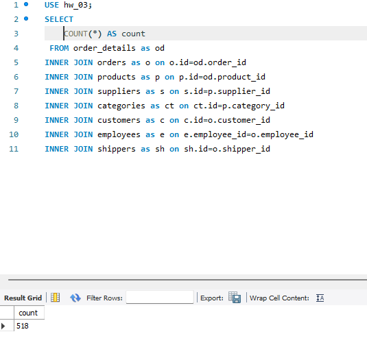

# Завдання 4: Додаткова обробка Exercise_3

## Опис
**На основі завдання №3 опрцьовуємо наступні задачі:**
1. Визначаємо к-ть отриманих рядків (за допомогою оператора COUNT).  
2. Змінюємо декілька операторів INNER на LEFT чи RIGHT. Визначаємо, що відбулося з кількістю рядків.
3. Обираємо тільки ті рядки, де employee_id > 3 та ≤ 10.
4. Групуємо за іменем категорії, рахуємо кількість рядків у групі, середню кількість товару.
5. Відфільтровуємо рядки, де середня кількість товару більша за 21.
6. Сортуємо рядки за спаданням кількості рядків.
7. Виводимо на екран чотири рядки з пропущеним першим рядком.


## 1. Визначаємо к-ть отриманих рядків (за допомогою оператора COUNT). 

```sql
USE hw_03;
SELECT 
    COUNT(*) AS count
 FROM order_details as od
INNER JOIN orders as o on o.id=od.order_id
INNER JOIN products as p on p.id=od.product_id 
INNER JOIN suppliers as s on s.id=p.supplier_id 
INNER JOIN categories as ct on ct.id=p.category_id
INNER JOIN customers as c on c.id=o.customer_id
INNER JOIN employees as e on e.employee_id=o.employee_id
INNER JOIN shippers as sh on sh.id=o.shipper_id
```
*Рисунок-9*  
  

## 2. Змінюємо декілька операторів INNER на LEFT чи RIGHT. Визначаємо, що відбулося з кількістю рядків. 

```sql
USE hw_03;
SELECT 
    COUNT(*) AS count
 FROM order_details as od
LEFT JOIN orders as o on o.id=od.order_id
LEFT JOIN products as p on p.id=od.product_id 
LEFT JOIN suppliers as s on s.id=p.supplier_id 
LEFT JOIN categories as ct on ct.id=p.category_id
LEFT JOIN customers as c on c.id=o.customer_id
LEFT JOIN employees as e on e.employee_id=o.employee_id
LEFT JOIN shippers as sh on sh.id=o.shipper_id
```
*Рисунок-10*  


При використанні `LEFT JOIN` нічого не змінилося, оскільки ми досить чітко з самого початку використали логічну структуру схеми


## 3. Обираємо тільки ті рядки, де employee_id > 3 та ≤ 10.

```sql
USE hw_03;
SELECT 
    COUNT(*) AS count
 FROM order_details as od
INNER JOIN orders as o on o.id=od.order_id
INNER JOIN products as p on p.id=od.product_id 
INNER JOIN suppliers as s on s.id=p.supplier_id 
INNER JOIN categories as ct on ct.id=p.category_id
INNER JOIN customers as c on c.id=o.customer_id
INNER JOIN employees as e on e.employee_id=o.employee_id
INNER JOIN shippers as sh on sh.id=o.shipper_id
```
*Рисунок-9*  
  

## Результати:  

*Рисунок-8 (Використання INNER JOIN)*  
  

Після кожного об'єднання к-ть рядків була незмінною (518)  
При цьому важливо зауважити, що в подібних запитах важливо перевіряти логіку крок за кроком, коректно називати таблиці та забезпечувати послідовність. Це забезпече можливість створення гнучкої вибірки для аналізу, або інших потреб.


*посилання на SQL*  
[SQL_3_Exercise](Exercise_3.sql)


